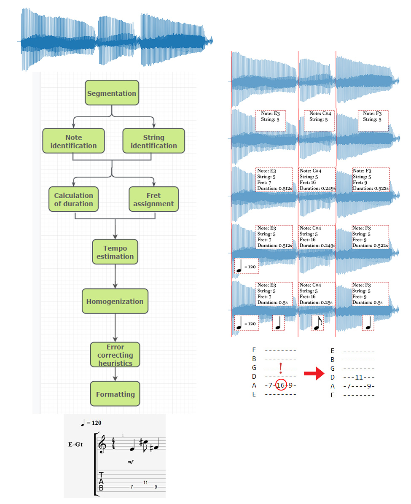
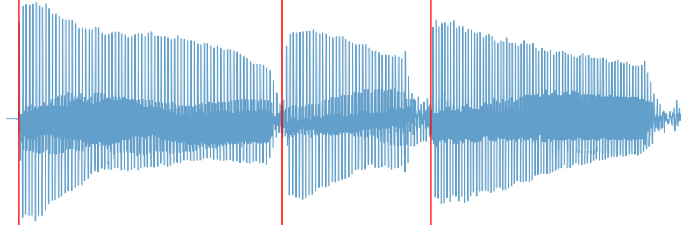
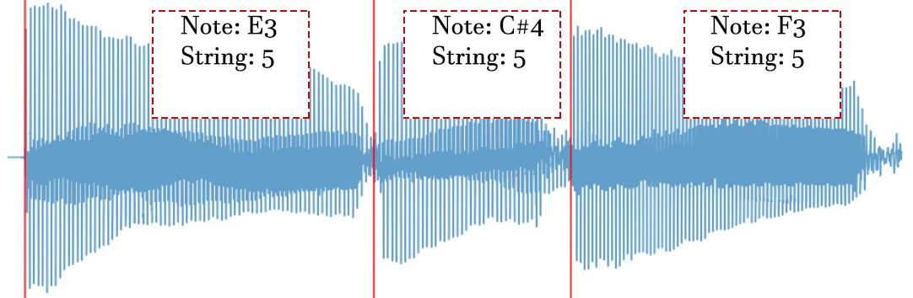
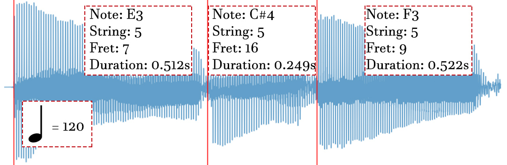
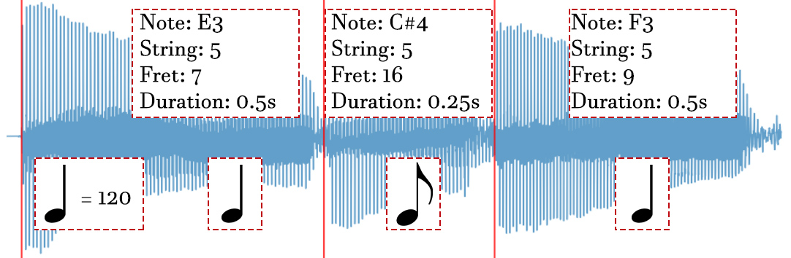
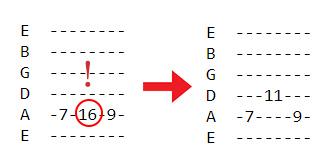
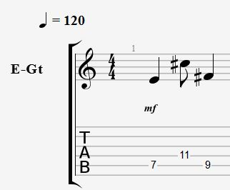

# Guitar Tablature Generator
## Contents
[What is Guitar Tablature Generator?](#what-is-guitar-tablature-generator?)  
[Why is it relevant?](#why-is-it-relevant?)  
[How do I install the project?](#how-do-i-install-the-project)  
[How do I use the application?](#how-do-i-use-the-application)  
[How does it work?](#how-does-it-work?)  
[Data](#data)  
[Project structure](#project-structure)  
[Model breakdown](#model-breakdown)  
[Performance](#performance)  
[Limitations](#limitations)

## What is Guitar Tablature Generator?
Guitar Tablature Generator is a project that aims to create an application capable of generating a [tablature](https://en.wikipedia.org/wiki/Tablature), including notes played, their value, the [fret](https://en.wikipedia.org/wiki/Fret) and string they are played on and the tempo of the music piece, from a raw guitar audio file. The resulting tab can be loaded into popular sheet music editor software [Guitar Pro](https://www.guitar-pro.com/en/index.php).

At present it is especially useful for guitar composers who want to easily create a tab of what they have just played, saving them the time of writing it manually.

## Why is it relevant?
Automatic music transcription is an ongoing field of research. Despite the ability and experience required for a person to translate a music piece, human performance in this field is still above that of machines.

There are commercial applications that extract musical notes from audio, but they are prone to error and already expect the user to manually correct these mistakes. Additionally, there seem to be no applications that address this specifically for guitar and guitar notation.

## How do I install the project?
Installation is quite tricky at the moment. To be safe you should (with conda at least):
 1. Clone this repository.
 2. Install pip version 18.1 `conda install pip==18.1`
 3. Create a new environment from the exported one provided `conda env create -f environment.yml -n your_env_name`
 4. Install requirements `pip install -r requirements.txt`

**NOTE**: You should re-train the LightGBM model by running the "Tempo/Tempo_lightgbm.ipynb" notebook if you want to use the pipeline in any way.

**NOTE**: You may need to install [FFmpeg](https://ffmpeg.org/download.html) and [tensorflow's gpu requirements](https://www.tensorflow.org/install/gpu)

## How do I use the application?

 1. Run "GUI.exe" located in "Final_app/dist/GUI".
 2. Click on *Browse* and locate your audio file.
 3. Choose your preferences:  
    3.1. Select *Manually input file bpm* if you know, at least approximately, the tempo of your file. Please note that in some cases, such as when there is a tremolo riff in your file, it is more desirable that you do this, as opposed to letting the program make an estimation.  
	 
	 3.2. Select *Display tab* if you wish to see a preview of the guitar tab. Keep in mind that this feature is not designed to display long tabs. 
	 
	 3.3. Select *Apply heuristics* to let the program apply post-prediction heuristics to correct mistakes in the tab (RECOMMENDED). 
	 
	 3.4. Select *Create gp5 file* if you want a Guitar Pro file with your tab to be generated. 
	 
4. Click on *Run tab generator*.
5. If you selected *Manually input file bpm*, a window will appear asking you to write the file's bpm.
6. If you selected *Create gp5 file*, a window will appear asking where to save the generated Guitar Pro file.
7. Once the calculations are done, you should be able to see the results.

## How does it work?
The project relies on [Supervised Machine Learning](https://en.wikipedia.org/wiki/Supervised_learning) techniques to solve this transcription problem, namely [Neural Networks](https://en.wikipedia.org/wiki/Artificial_neural_network) and [Gradient Boosting](https://en.wikipedia.org/wiki/Gradient_boosting). The processing of the file, or *pipeline*, follows several stages:

*Guitar Tab Generator Pipeline*

### 1. Segmentation
The first step involves dividing the input file, which is essentially a long waveform, into individual notes. The output of this step is an indication of where (or rather, when) each individual note starts.

Even if by visualizing the waveform detecting note onsets seems intuitive, automatic detection is prone to false positives, given the low occurrence of note onsets compared to non-onsets. This is why an ensemble of several prediction models (1 rule-based custom model and 4 Neural Networks) was necessary.

#### 1.1. Amplitude rule model
This model was build based on the idea that a note change implies a sudden variation of the amplitude of the wave's [envelope](https://en.wikipedia.org/wiki/Envelope_%28waves%29). This is not necessarily true, but it works for most cases. The model works as follows:

1.1.1. Calculates the envelope.  1.1.2. Finds candidates where there is a drastic change in the envelope's amplitude.  1.1.3. Removes unusually short candidates using statistical information.  1.1.4. Checks whether it has missed a note using the note identification Neural Network. Basically, it checks whether between two onset candidates there is a change in the predicted note (in case there is, an onset was missed where the prediction changes). 1.1.5. Double check the middle point between two candidates with a more accurate envelope. 

#### 1.2. Onset detection Neural Networks
These Neural Networks were trained to, given a short piece of a waveform, detect whether there is a note onset or not. They are run throughout the whole wave. These are either based on temporal information from the wave or spectral (from the [frequency domain](https://en.wikipedia.org/wiki/Frequency_domain)) and are either narrow (shorter piece) or broad (longer piece):

 - Temporal narrow window NN
 - Temporal broad window NN
 - Spectral narrow window NN
 - Spectral broad window NN

*Segmentation*

### 2. Note identification
The next step is to, given an individual note, identify its [chroma](https://en.wikipedia.org/wiki/Chroma_feature) and [octave height](https://en.wikipedia.org/wiki/Octave), individuating it as a specific frequency. This is done with a Neural Network that is capable of classifying a segment of audio into 61 different notes, ranging from E1 to E6, which is the note range of an 8-string guitar (tuned to E B E A D G B E).

### 3. String identification
Similarly, for each individual note, the string it is played on is estimated with a Neural Network which classifies audio input into 8 different classes corresponding to 8 different strings. There is no direct correspondence between note and string because the same note can be played in different strings.
 

*Note and string identification*
### 4. Fret assignment and calculation of duration
Note duration is simply calculated as the difference between its onset and the next one. As for the [fret](https://en.wikipedia.org/wiki/Fret), there is a one-to-one correspondence between a string-note combination and the fret that corresponds to it. 

However, some string-note combinations are impossible, so this also serves as an error detection mechanism. In such cases there are two possible corrections:

 - If the confidence of the note predictor is low, the next most likely *note* is picked.
 - If it is not low, then the next most likely *string* is picked.

The process is run iteratively until a possible note-string combination is found.
 

*Fret assignment and calculation of duration*

### 5. Tempo estimation
In case the number of beats per minute (bpm) of the musical piece is not provided by the user, [tempo](https://en.wikipedia.org/wiki/Tempo) is estimated by the program. This is done running a Gradient Boosting model over 8 consecutive notes at a time and then averaging the predictions. If the piece contains less than 8 notes, however, it is estimated by assigning the median of all durations as the duration of an [eighth note](https://en.wikipedia.org/wiki/Eighth_note) and calculating the tempo that corresponds to this.
 

*Tempo estimation*

### 6. Homogenization
In this step notes are rounded to the closest duration that corresponds to a certain value (quarter note, eighth note, etc). By now the result is a raw music sheet.
 

*Homogenization*

### 7. Error correction heuristics
 At this point, the user can decide whether to apply post-prediction heuristics or not. These detect unusual patterns in the music sheet and interpret them as mistakes made in earlier stages, thus replacing them with more likely patterns. Currently there are two available heuristics:
 
 - If a note is close (in terms of frequency) to the previous one but the frets are far from each other, then the string of the second note is changed so that the new fret is close to the previous.
 - If a note's fret is far from the previous and the confidence of the string prediction is low, then the next most likely string is selected.

*Heuristics*

### 8. Formatting
The final stage consists in transforming the raw music sheet into a Guitar Pro tab. This is done making use of [PyGuitarPro](https://github.com/Perlence/PyGuitarPro).
 

*Final sheet*

## Data
All of the data was extracted from DI recordings of an Ibanez RG8 guitar played by myself. In the future, the models could be re-trained with recordings from different guitars so as to improve generalization.

**NOTE:** Some prior work was carried out with synthesized pianos and piano samples from free libraries.

The audio files were downsampled to 8 kHz in order to reduce the number of features that would be used when training a model. Precision is lost as a result, but this should not be a problem for the purpose of this data, since information about frequency, harmonics, etc is not lost.

Data extraction from audio was carried out using [librosa](https://github.com/librosa/librosa) and could be either from the temporal domain or the frequency domain, depending on the goal of the model that would be trained with it.

## Project structure
The project is structured into several folders:

 - **Audio_processing_tests**: Here is code testing `librosa`, with some basic analysis of simple waveforms.
 - **Data**: Here is where all the data is kept. It is divided into piano and guitar data.
 - **Final_app**: Folder containing both the final application and the code and files necessary to build it. The app itself is located in the "dist" sub-folder.
 - **GUI**: Here is all of the code used to generate the graphical user interface of the app. It includes a working IPython Notebook version of the app ("GUI.ipynb").
 - **Pipeline**: Folder containing the project's pipeline, "Sheet_generator.ipynb", from segmentation to final formatting (see the *How does it work?* section). It also includes the "Sheet_generator_example.ipynb" notebook that can be used to test the pipeline.
 - **Samples**: Here all raw audio files (both for piano and guitar) are kept. There are two types of guitar audio files: those located in "Guitar/Ind_notes" are made up of consecutive individual notes played on the same string, while those located in "Guitar/Riffs" are actual guitar [riffs](https://en.wikipedia.org/wiki/Ostinato#Riff), emulating natural guitar playing.
 - **Segmentation**: Here both the code used to train the note segmentation models and the models themselves are present.
 - **Single_note_models**: In this folder the models used for note and string identification, along with the code used to train them, can be found.
 - **Tempo**: Here are all models tested for tempo prediction.
 - **Utilities**: This folder contains the "Utilities.ipynb" notebook, which is made up of useful functions and classes that are used throughout the project. Inside "Dataset_generators" is all of the code used to generate the data (see "Data" folder) from the audio samples (see "Samples" folder).

## Model breakdown
### Neural Networks
All of the Neural Networks used in this project were composed of a similar architecture: two hidden layers and an output layer, all of which were densely-connected. The first layer usually had a linear [activation function](https://en.wikipedia.org/wiki/Activation_function), the second a [Rectified Linear Unit (ReLU)](https://en.wikipedia.org/wiki/Rectifier_%28neural_networks%29) and the last a [SoftMax](https://en.wikipedia.org/wiki/Softmax_function) (used in classification). The number of inputs for each layer was always lower than that of the preceding layer.

In order to avoid [overfitting](https://en.wikipedia.org/wiki/Overfitting), a combination of [dropout](https://en.wikipedia.org/wiki/Dropout_%28neural_networks%29) layers, along with [L1](https://en.wikipedia.org/wiki/Lasso_%28statistics%29) and [L2](https://en.wikipedia.org/wiki/Tikhonov_regularization) regularization was used, depending on the case. The optimizer chosen to train the networks was the [Adam optimizer](https://towardsdatascience.com/adam-latest-trends-in-deep-learning-optimization-6be9a291375c). The Neural Networks API used was [Keras](https://keras.io/).

### Gradient Boosting
Gradient Boosting was used exclusively to predict the tempo of a musical audio file, since for other purposes it performed worse than Neural Networks. Tempo prediction models were trained using [XGBoost](https://github.com/dmlc/xgboost), [CatBoost](https://github.com/catboost/catboost) and [LightGBM](https://github.com/microsoft/LightGBM) due to setbacks when trying to implement them into the final application. Finally, the tempo estimation now runs with the LightGBM model, which uses [decision trees](https://en.wikipedia.org/wiki/Decision_tree_learning) with a maximum depth of 10.

## Performance
Accuracy:
 - Overall: **83.91%**
 - Segmentation: **94.64%**
 - Note identification: **96.32%**
 - String identification: **90.37%**
 
 

Mean Absolute Error of the tempo detection model: **8.61**

## Limitations
At present, there are several limitations to the application:

 - It has only been tested with **mp3** files, so it is not guaranteed to work with other formats.
 - **IMPORTANT**: The musical piece played must be **linear**, i.e. one note at a time, meaning chords will not be detected as such and will be interpreted as single notes.
 - For now the program has been tested with **short tabs** (1-2 bars) only. It should work for longer tabs, but it is not guaranteed.
 - Musical **silences** are **not** built-in, so they might not appear in the final tab.
 - Even if recordings have been done with an 8-string guitar, for now only the 6 standard strings will appear in the output.
 - All music will be presented in **4/4** time signature.
 - It is **not** recommended to include **Slides, vibratos, hammer-ons**, etc.
